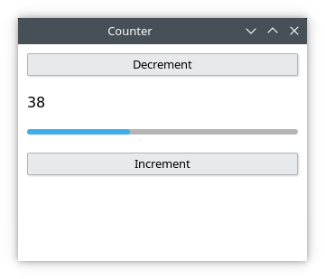
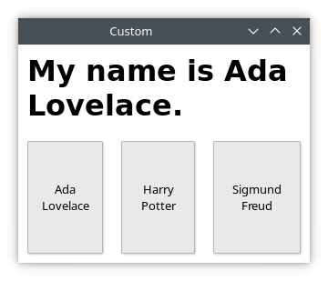

# neutrino

A GUI frontend in Rust based on web-view

## Usage (only tested on Linux)

You can run the examples using the following commands :

```bash
neutrino run --example counter
```


```bash
neutrino run --example custom
```
